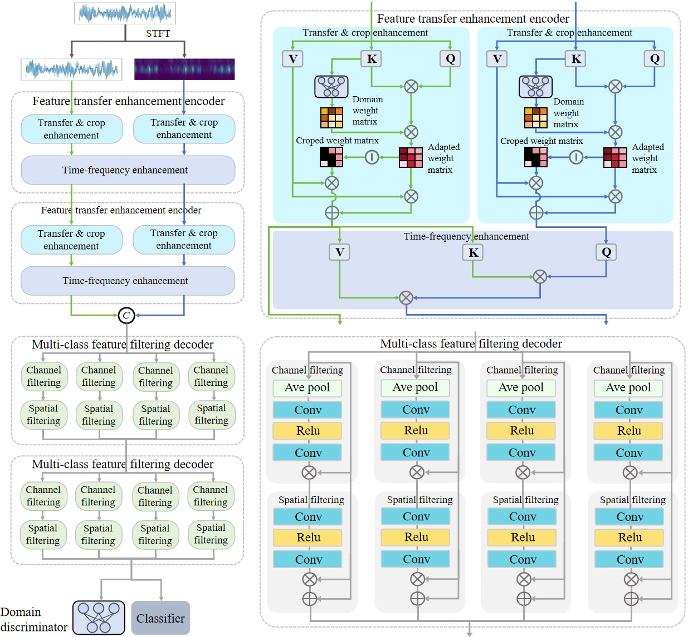

# Dashnosis: Bearing Compound Fault Diagnosis Overcoming Scarcity of Compound Fault Data and Domain Shift

This repository provides the implementation and supplementary materials for the paper:

 **[Dashnosis: Bearing Compound Fault Diagnosis Overcoming Scarcity of Compound Fault Data and Domain Shift](./Dashnosis.pdf)**

Dashnosis is designed for **cross-domain bearing compound fault diagnosis** under two practical challenges: the scarcity of compound-fault training data and distribution shifts caused by varying operating conditions.

## Framework

The overall architecture of Dashnosis is illustrated below.

  

  <b>Overall framework of Dashnosis.</b>

---

## Dataset

The datasets used in this work are publicly available:

- **BJTU-RAO Bogie Dataset**: https://drive.google.com/drive/folders/1RlZvFw-v07VvsL2Ni9cS7iFrTPDIhn2r?usp=sharing
- **HUSTbearing Dataset**: https://drive.google.com/drive/folders/1UMOvyfstYJRyR0rPw0OfH-tIjJg2_0aN?usp=sharing